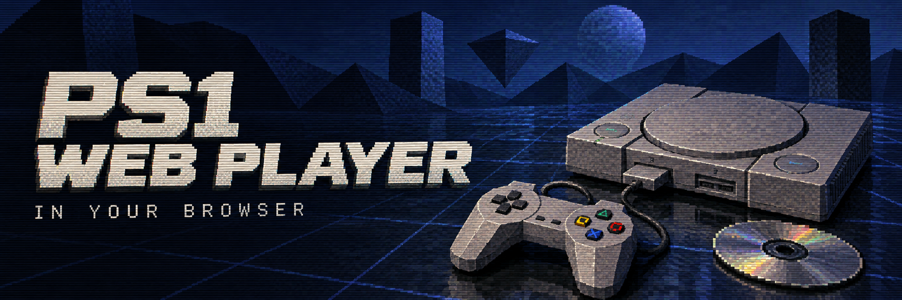

# PS1 Web Player

Plays PlayStation 1 disc images in the browser with Vite + React + [EmulatorJS](https://emulatorjs.org)
(`pcsx_rearmed` libretro core compiled to WebAssembly, loaded from the EmulatorJS CDN).

**No games are included.** Use a disc image you dumped from a game you own. Don't commit
disc images or Sony BIOS files to this repository.

```
npm install
npm run dev
```

Then pick your disc image (`.bin`, `.chd`, `.pbp`) in the page. For quicker restarts you can
put it at `public/roms/sheep-raider.bin` (the folder is git-ignored; the file name is kept
because the memory card and save names are derived from it), and a "Play bundled disc"
button appears.

- Developed and tuned against Sheep Raider (NTSC-U), so the defaults below assume it.
- The UI is in English and Brazilian Portuguese (EN/PT switch, top right; defaults to the
  browser language). Strings live in `src/i18n.ts`; the emulator's own menus follow the
  language chosen when the game boots.
- `public/player.html` hosts EmulatorJS in an iframe, since it relies on globals and
  can't be torn down cleanly inside React. The React app passes `?rom=&name=` to it.
- Graphics presets (see `src/graphics.ts`):
  | Preset | Core | What it does |
  |---|---|---|
  | Original | PCSX-ReARMed | native 320×240 |
  | Smooth (default) | PCSX-ReARMed | no dithering + SABR edge-smoothing shader |
  | Enhanced | Beetle PSX (software renderer) | 2× internal resolution, no dithering |
  | Ultra | Beetle PSX (software renderer) | 4× internal resolution, no dithering |
  | Retro CRT | PCSX-ReARMed | CRT shader |

  Measured in headless Chrome on an M1 Pro: all hold 60 fps; Ultra dipped to ~50 in the 3D intro.
- Beetle's *hardware* (WebGL) renderer crashes on start in the EmulatorJS build, so texture
  filtering, 32-bit color and PGXP aren't available; shaders stand in for smoothing.
- BIOS: PCSX-ReARMed has a built-in HLE BIOS. Beetle needs one, so the app bundles the
  open-source OpenBIOS (`public/bios/openbios.bin`, MIT, PCSX-Redux, from the Libreboot
  20241206 release, sha512-verified). Users can load their own `SCPH-5501` dump in the UI for
  better compatibility; it's stored in IndexedDB and injected via `EJS_externalFiles`
  (`EJS_biosUrl` can't take a File/Blob in stable EmulatorJS).
- Memory card (`src/memcard.ts`, `public/player.html`): one canonical 128 KB card per game in
  IndexedDB (`sheep-raider` DB, key `card:<game>`), loaded into whichever core runs and written
  back within 10 s of any change, when the tab is hidden, and before Stop / Apply & restart.
  EmulatorJS alone keeps a separate `.srm` per core and flushes it only every 5 minutes.
  The UI can export/import the raw `.srm` (same format as `.mcr`/`.mcd` in other emulators).
  Save states are stored in the browser too, but they're per core and not portable.
- Controls: Enter = Start, arrows = D-pad, X/Z/A/S = face buttons (remappable in the
  emulator's control settings). Gamepads work too. Remapped controls are kept in localStorage
  (`sheep-raider:controls`, shared by all cores) by `public/player.html`, since
  `EJS_disableLocalStorage` turns off EmulatorJS's own saving.

Notes for a real deployment: a disc image is up to ~700 MB and is loaded fully into memory. Convert
it to CHD (`chdman createcd -i game.cue -o game.chd`) to roughly halve the download, and
serve it from a CDN/object storage rather than the app bundle.

## License

MIT, see [LICENSE](LICENSE). This covers the code in this repository only.
`public/bios/openbios.bin` is OpenBIOS from PCSX-Redux, also MIT
(see `public/bios/OPENBIOS-LICENSE.txt`). EmulatorJS is GPL-3.0 and is loaded from its CDN,
not redistributed here. Game names are trademarks of their respective owners; this project
is not affiliated with or endorsed by them.
